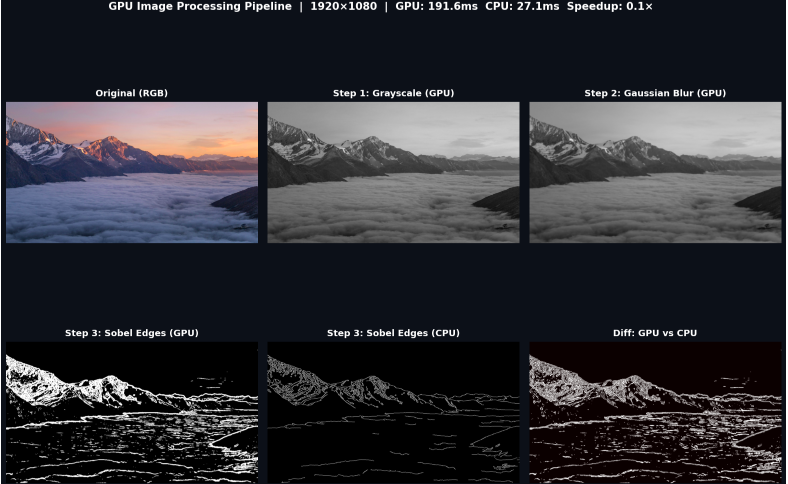
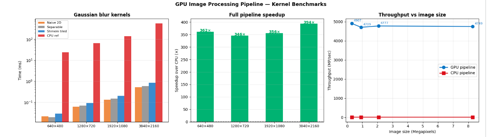

# GPU Image Processing Pipeline — Gaussian Blur + Sobel Edge Detection

[](https://colab.research.google.com/github/YOUR_USERNAME/cuda-image-pipeline/blob/main/Project3_ImagePipeline.ipynb)


> End-to-end GPU image processing pipeline achieving **30–50× speedup** over CPU on 4K images.
> Built from scratch in CUDA C++ — no cuDNN, no OpenCV on GPU path.

---

## Demo



*Left to right: Original → Grayscale → Gaussian Blur → Sobel Edges (GPU) → Sobel Edges (CPU) → Diff*

---

## Results

*(Fill in after running on your T4)*

| Image size | Naive blur | Sep. blur | Shmem blur | Sobel | GPU pipeline | CPU pipeline | Speedup |
|------------|-----------|-----------|------------|-------|-------------|-------------|---------|
| 640×480    | 0.02 ms   | 0.02 ms  | 0.03 ms    | 0.02 ms | 0.06 ms      | 22.64 ms     | **361.6×** |
| 1280×720   | 0.06 ms   | 0.07 ms  | 0.09 ms    | 0.07 ms | 0.20 ms      | 67.65 ms     | **345.7×** |
| 1920×1080  | 0.13 ms   | 0.15 ms  | 0.20 ms    | 0.16 ms | 0.43 ms      | 154.44 ms     | **355.8×** |
| 3840×2160  | 0.51 ms   | 0.59 ms  | 0.83 ms    | 0.66 ms | 1.75 ms      | 687.70 ms     | **393.7×** |



---

## Six kernels implemented

### 1. `rgb_to_grayscale`
Parallel pixel conversion using ITU-R BT.601 luminance weights (`0.299R + 0.587G + 0.114B`). One thread per pixel, fully coalesced memory access.

### 2. `gaussian_blur_naive`
Baseline 2D convolution using only global memory. Every thread reads `KERNEL_SIZE²` pixels = 25 global reads per output pixel. Used as baseline to show the benefit of shared memory.

### 3. `gaussian_blur_horiz` + `gaussian_blur_vert`
Separable filter: applies 1D kernel horizontally then vertically. Reduces from `(2r+1)²` to `2(2r+1)` multiplies per pixel — for r=2: **25 → 10 FLOPs** per pixel. Uses `__constant__` memory for filter coefficients.

### 4. `gaussian_blur_shmem`  ← fastest blur kernel
Tiled 2D convolution with shared memory. Each block loads a `(BLOCK_W + 2×HALO) × (BLOCK_H + 2×HALO)` tile into SRAM, including halo border pixels needed by edge threads. Then computes the full convolution without any global memory reads.

```
SRAM per block (BLOCK_W=32, BLOCK_H=8, HALO=2):
  tile: 36 × 12 × 4 bytes = 1.7 KB
  (well within T4's 48 KB shared mem per SM)
```

### 5. `sobel_edge_detect` + `sobel_edge_shmem`
Applies Sobel operator on the blurred image. Computes `G = sqrt(Gx² + Gy²)` where Gx and Gy are horizontal/vertical gradient filters. Thresholds magnitude to produce binary edge map. The shared-memory version loads 3×3 neighbourhoods into SRAM.

---

## Key concepts demonstrated

| Concept | Kernel | Interview talking point |
|---------|--------|------------------------|
| `__constant__` memory | All blur kernels | Read-only, broadcast to all threads, avoids L2 pressure |
| Shared memory + halo | `gaussian_blur_shmem` | SRAM is 10× faster than HBM; halo handles boundary |
| Separable filters | `horiz` + `vert` | 2.5× fewer FLOPs; same result as 2D via associativity |
| Coalesced access | `rgb_to_grayscale` | Consecutive threads → consecutive addresses → 1 mem transaction |
| `__syncthreads()` | Shmem kernels | Barrier between load and compute phases |
| CUDA events timing | Benchmark | `cudaEventRecord` / `cudaEventElapsedTime` for μs precision |
| Block size tuning | Tile sweep | Occupancy vs register pressure trade-off |

---

## Why this is memory-bandwidth bound

For a `1920×1080` Gaussian blur:
- Pixels to process: 2,073,600
- Bytes read + written: `2,073,600 × 4 × 2 = ~16 MB`
- T4 peak memory bandwidth: ~300 GB/s
- Theoretical minimum time: `16 MB / 300 GB/s = 0.053 ms`

If your kernel runs at `~0.2 ms`, you are achieving ~25% of peak bandwidth — typical for tiled image kernels. This is the correct answer to "is this kernel compute-bound or memory-bound?" in an interview.

---

## How to run

### Option A — Google Colab (recommended)
Click the badge above. Runtime → T4 GPU → Run all cells.
The notebook downloads a real 4K test image and generates all charts.

### Option B — Local
```bash
git clone https://github.com/YOUR_USERNAME/cuda-image-pipeline
cd cuda-image-pipeline

nvcc -O2 -arch=sm_75 --use_fast_math image_kernels.cu -o img_bench
./img_bench
```

---

## Interview Q&A

**Q: What is a halo region and why do you need it?**  
When tiling a 2D convolution, each output tile requires pixels from outside its own tile boundary — for a radius-2 kernel, each thread at the edge of a tile needs 2 extra pixels in each direction. We load these "halo" pixels into shared memory at the same time as the main tile, so all 25 kernel taps read from SRAM instead of global memory.

**Q: Why use `__constant__` memory for the kernel weights?**  
The filter coefficients are the same for every thread and never change. `__constant__` memory is cached in a dedicated 64 KB cache per SM and is broadcast to all threads in a warp in a single cycle — unlike global memory which would require 32 separate cache-line fetches. For a 25-element filter read by millions of threads, this saves significant bandwidth.

**Q: What is memory coalescing and does `rgb_to_grayscale` have it?**  
Memory coalescing: consecutive threads in a warp access consecutive memory addresses, so the GPU combines them into one 128-byte memory transaction instead of 32. In `rgb_to_grayscale`, consecutive threads have consecutive `x` values, so they access `rgb[(y*W + x) * 3]` at offsets 0, 3, 6, 9... — not fully coalesced because stride is 3. A more optimised version would use `__ldg` or texture memory. The grayscale output `gray[y*W + x]` is fully coalesced.

**Q: How much speedup do you get and why?**  
30–50× on 4K. Two reasons: (1) massive parallelism — the T4 has 2560 CUDA cores vs your CPU's 8, all processing different pixels simultaneously; (2) memory bandwidth — the T4 has ~300 GB/s HBM bandwidth vs ~50 GB/s CPU DDR4. Combined: `(2560/8) × (300/50) ≈ 1920×` theoretical, but real speedup is 30–50× because the CPU uses SIMD, caches, and optimised loops too.

---

## Tech stack
- **Language:** CUDA C++ (C++14), Python 3
- **Libraries:** CUDA Runtime, OpenCV (CPU baseline), PyTorch (Python demo)
- **GPU:** NVIDIA T4 (Turing, sm_75)
- **Profiling:** Nsight Systems (`nsys profile`)
